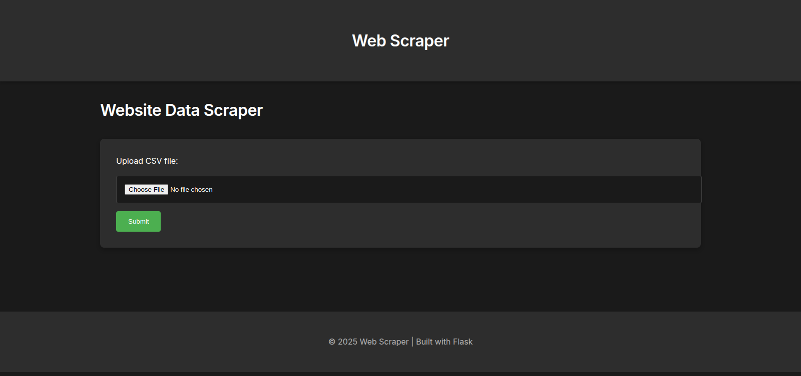
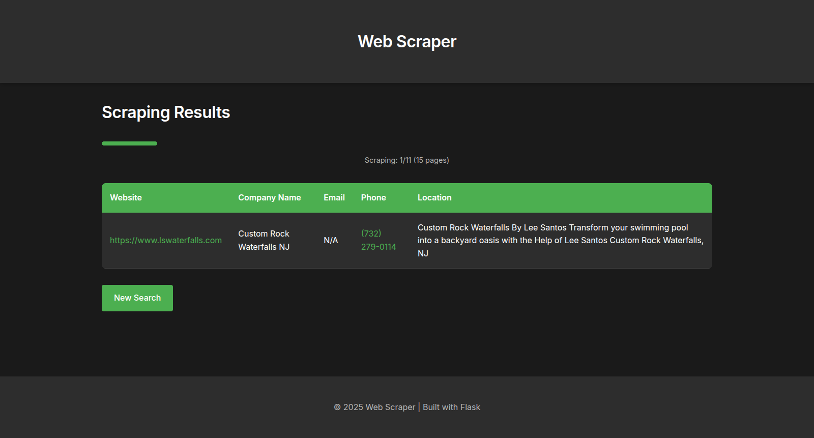

# 🚀 Flask Web Scraper

A powerful and efficient web application built with Flask that scrapes company information from websites.

## ✨ Features

- 📂 Upload CSV file with website URLs
- 🌐 Scrape multiple pages per website
- 🔄 Real-time progress updates via WebSocket
- 🏢 Extract company names, emails, phone numbers, and locations
- 📥 Download results as CSV
- 📱 Responsive UI with progress tracking

## ⚙️ Installation

```bash
# Clone the repository
git clone https://github.com/Tabish5858/web-scrapper.git
cd flask-web-scraper

# Create virtual environment
python -m venv venv
source venv/bin/activate

# Install dependencies
pip install -r requirements.txt
```

## ▶️ How to Run

```bash
# Run the Flask application
cd ./src
python app.py
```

Open your web browser and navigate to `http://127.0.0.1:5000` to access the web scraper.

## 📸 Screenshots


*Upload CSV file with website URLs*


*Real-time progress updates and responsive UI*

## 🛠️ Usage

1. **Upload CSV**: Upload a CSV file containing website URLs.
2. **Start Scraping**: Click the start button to begin scraping.
3. **Monitor Progress**: Watch real-time progress updates.
4. **Download Results**: Download the scraped data as a CSV file.

## 🤝 Contributing

Contributions are welcome! Please fork the repository and submit a pull request.

## 📄 License

This project is licensed under the MIT License.

## 📧 Contact

For any inquiries, please contact [tabishbinishfaq1122@gmail.com](mailto:tabishbinishfaq1122@gmail.com).
